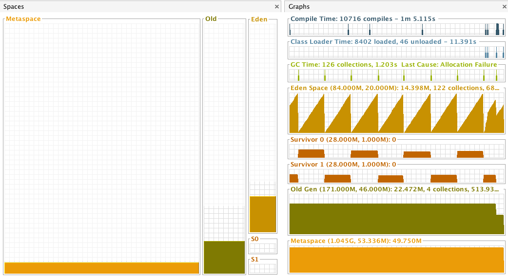

# JVM内存配置参数

>  jvm setting的参数确实比较多（Oracle官网[Java HotSpot VM Options](https://www.oracle.com/technetwork/articles/java/vmoptions-jsp-140102.html)），但是作为一名java开发者，那几个最常用最基本的参数设置和意义一定要死记和理解。这里推荐一个网站http://jvmmemory.com/在上面你可以方便的设置jvm的参数（当然这个网站上也是有些错误的，最可靠的还是去查下Oracle的文档）。 

`Notice`:这里我们默认以Linux JAVA8 hotspot环境为例，其Oracle官网[Java Platform, Standard Edition Tools Reference](https://docs.oracle.com/javase/8/docs/technotes/tools/unix/java.html)（这里面有详细参数配置说明）。

下面给出14个最常用和最基本的内存配置参数。

| 参数                      | 等同于                    |
| :------------------------ | :------------------------ |
| -Xss1024k                 | -XX:ThreadStackSize=1024k |
| -Xms512m                  |                           |
| -Xmx1024m                 | -XX:MaxHeapSize=1024m     |
| -Xmn512m                  |                           |
| -XX:NewSize=512m          |                           |
| -XX:MaxNewSize=512m       |                           |
| -XX:NewRatio=8            |                           |
| -XX:SurvivorRatio=32      |                           |
| -XX:MinHeapFreeRatio=40   |                           |
| -XX:MaxHeapFreeRatio=70   |                           |
| -XX:MetaspaceSize=128m    |                           |
| -XX:MaxMetaspaceSize=256m |                           |

首先我们来看看jvm内存模型结构，这里不详细叙述，我用一张图来让你过目不忘（jvisualvm visualGC插件，下图并非以上jvm参数设置，只是为了方便对jvm内存模型记忆）。当然了，这张图死磕也要永久记住的，有了他我们记忆以上几个参数不再是难事，时间久了也不会感觉陌生或者忘记。

一个重要的概念就是我们常常所说的设置jvm的内存参数大多关注的是堆内存的大小，你可以简单理解成这样：

* `堆内存 = Old + Eden + S0 + S1` 

* `年轻代 = Eden（新生代） + S0 + S1 `

### 栈内存大小相关设置

#### -Xss1024k

- 设置线程栈占用内存大小。
- 默认值：不同的操作系统平台，其默认值不同，具体看官网说明。

### 堆内存大小相关设置

#### -Xms512m

-  设置堆内存初始值大小。
- 默认值：如果未设置，初始值将是老年代和年轻代分配制内存之和。

#### -Xmx1024m

- 设置堆内存最大值。
- 默认值：default value is chosen at runtime based on system configuration,具体请查看官网或者查看讨论[How is the default Java heap size determined?](https://stackoverflow.com/questions/4667483/how-is-the-default-java-heap-size-determined)。

### 年轻代内存大小相关设置

#### -Xmn512m

- 设置新生代的初始值及最大值。
- 默认值：堆内存的1/4（这里要记住不是最大堆内存，还是已经分配的堆内存的1/4）。

#### -XX:NewSize=512m

- 设置新生代的初始值。

#### -XX:MaxNewSize=512m

- 设置新生代的最大值。

### 比率方式设置

#### -XX:NewRatio=8

- 设置老年代和年轻代的比例。比如：-XX:NewRatio=8 表示`老年代内存:年轻代内存=8:1 => 老年代占堆内存的8/9;年轻代占堆内存的1/9`。
- 默认值：2 。

#### -XX:SurvivorRatio=8

- 设置新生代和存活区的比例（这里需要注意的是存活区指的是其中一个）。比如：-XX:SurvivorRatio=8 表示`存活区：新生代=1：8 =》新生代占年轻代的8/10,每个存活区各占年轻代的1/10`。
- 默认值：8 。

#### -XX:MinHeapFreeRatio=40

- GC后，如果发现空闲堆内存占到整个预估上限值的40%，则增大上限值。
- 默认值：40 。

#### -XX:MaxHeapFreeRatio=70

- GC后，如果发现空闲堆内存占到整个预估上限值的70%，则收缩预估上限值。
- 默认值：70。

### Meta大小相关设置

#### -XX:MetaspaceSize=128m

- 初始元空间大小，达到该值就会触发垃圾收集进行类型卸载，同时GC会对该值进行调整：如果释放了大量的空间，就适当降低该值；如果释放了很少的空间，那么在不超过MaxMetaspaceSize时，适当提高该值。
- 默认值：依赖平台。

#### -XX:MaxMetaspaceSize=256m

- 设置元空间的最大值，默认是没有上限的，也就是说你的系统内存上限是多少它就是多少。
- 默认值：默认没有上限，在技术上，Metaspace的尺寸可以增长到交换空间。

>  以上就是14个参数，为了深刻理解，建议本地配置让后观察内存大小变化（可以使用jmap -heap pid 或者 visualGC来帮助观察）验证自己的理解是否正确。

[参考]

* https://cloud.tencent.com/developer/article/1406848