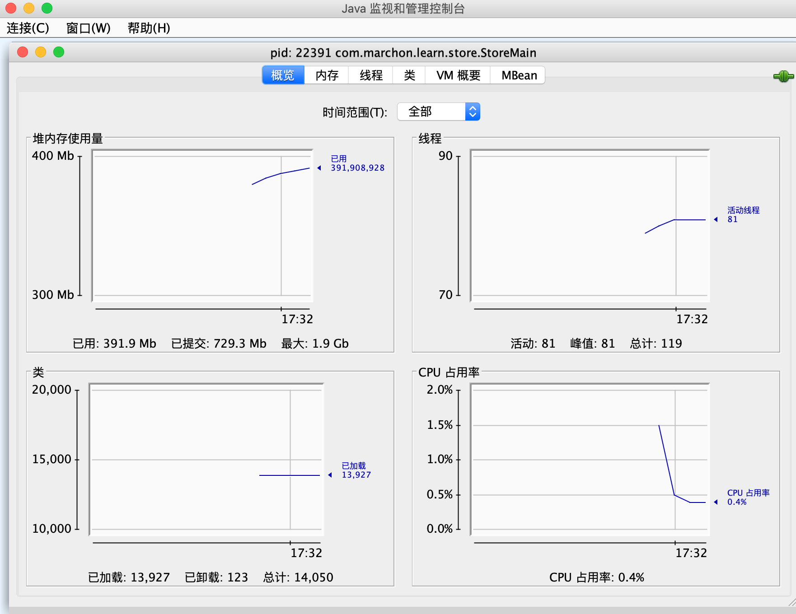
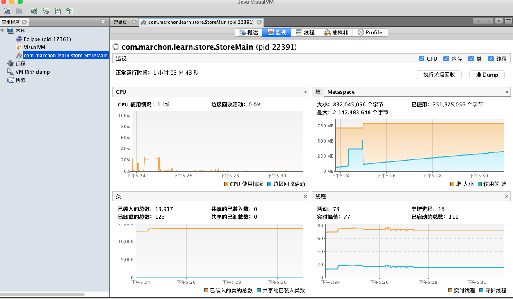

## 概述
在JDK的bin目录下有很多命令行工具


这些工具大多数是jdk\lib\tools.jar类库的一层薄包装而已，他们的主要功能代码是在tools类库中实现的，借助tools.jar类库里面的接口，我们可以直接在应用程序中实现功能强大的监控分析功能。

### java dump
java dump就是虚拟机运行时的快照，将虚拟机运行时的状态和信息保存到文件中，包括：
- 线程dump：包含所有线程的运行状态，纯文本格式
- 堆dump：包含所有堆对象的状态，二进制格式

### 常用命令
1. jps：查看本机java进程信息
2. jstack：打印线程的栈信息，制作线程dump文件
3. jmap：打印内存映射信息，制作堆dump文件
4. jstat：性能监控工具
5. jhat：内存分析工具，用于解析堆dump文件并以适合人阅读的方式展示出来
6. jconsole：简易的JVM可视化工具
7. jvisualvm：功能更强大的JVM可视化工具


## jps

显示当前所有java进程pid的命令，可以通过这个命令来查看到底启动了几个java进程（因为每一个java程序都会独占一个java虚拟机实例），不过jps有个缺点是只能显示当前用户的进程id，要显示其他用户的还只能用linux的ps命令。

执行jps命令，会列出所有正在运行的java进程，其中jps命令也是一个java程序。前面的数字就是进程的id，这个id的作用非常大，后面会有相关介绍。

```bash
[root@zhimin serops]# jps -h
illegal argument: -h
usage: jps [-help]
       jps [-q] [-mlvV] [<hostid>]

Definitions:
    <hostid>:      <hostname>[:<port>]

#列出所有正在运行的java进程
[root@zhimin serops]# jps
41576 Bootstrap
58348 Jps
```

`jps -l` 输出应用程序main.class的完整package名或者应用程序jar文件完整路径名

```bash
[root@zhimin serops]# jps -l
41576 org.apache.catalina.startup.Bootstrap
58593 sun.tools.jps.Jps
```

`jps -v` 输出传递给JVM的参数

```bash
[root@zhimin serops]# jps -v
41576 Bootstrap -Djavax.sql.DataSource.Factory=org.apache.commons.dbcp.BasicDataSourceFactory -Djava.awt.headless=true -Xmx128m -XX:+UseConcMarkSweepGC -Xmx6144m -Xms4096m -XX:PermSize=256M -XX:MaxPermSize=512M -Dfile.encoding=gbk -Djsse.enableSNIExtension=false -Dorg.apache.tomcat.util.buf.UDecoder.ALLOW_ENCODED_SLASH=true -Dcom.sun.management.jmxremote -Djava.rmi.server.hostname=10.10.2.203 -Dcom.sun.management.jmxremote.authenticate=false -Dcom.sun.management.jmxremote.ssl=false -Dcom.sun.management.jmxremote.port=12345 -Dcatalina.base=/usr/share/tomcat -Dcatalina.home=/usr/share/tomcat -Djava.endorsed.dirs= -Djava.io.tmpdir=/var/cache/tomcat/temp -Djava.util.logging.config.file=/usr/share/tomcat/conf/logging.properties -Djava.util.logging.manager=org.apache.juli.ClassLoaderLogManager
58664 Jps -Denv.class.path=.:/usr/local/java/jdk1.7.0_80/lib:/usr/local/java/jdk1.7.0_80/lib/tools.jar -Dapplication.home=/usr/local/java/jdk1.7.0_80 -Xms8m
```

###jps失效

我们在定位问题过程会遇到这样一种情况，用jps查看不到进程id，用ps -ef | grep java却能看到启动的java进程。

要解释这种现象，先来了解下jps的实现机制：

> java程序启动后，会在目录/tmp/hsperfdata_{userName}/下生成几个文件，文件名就是java进程的pid，因此jps列出进程id就是把这个目录下的文件名列一下而已，至于系统参数，则是读取文件中的内容。

我们来思考下：如果由于磁盘满了，无法创建这些文件，或者用户对这些文件没有读的权限。又或者因为某种原因这些文件或者目录被清除，出现以上这些情况，就会导致jps命令失效。

如果jps命令失效，而我们又要获取pid，还可以使用以下两种方法：

* top | grep java

* ps -ef |grep java

如果是用户没有读的权限，需要切换到对应的用户

```bash
[root@zhimin public]# /usr/local/java/jdk1.7.0_80/bin/jps
41576 -- process information unavailable
58909 Jps

[root@zhimin public]# su - tomcat

#如果tomcat用户没有开户登录权限，需要更新用户权限
[root@zhimin public]# grep tomcat /etc/passwd
tomcat:x:91:91:Apache Tomcat:/usr/share/tomcat:/sbin/nologin
#开启用户登录权限
[root@zhimin public]# usermod -s /bin/bash tomcat
```


##jstack

主要用于生成指定进程当前时刻的线程快照，线程快照是当前java虚拟机每一条线程正在执行的方法堆栈的集合，生成线程快照的主要目的是用于定位线程出现长时间停顿的原因，如线程间死锁、死循环、请求外部资源导致长时间等待。


##jmap

主要用于打印指定java进程的共享对象内存映射或堆内存细节。`堆Dump是反映堆使用情况的内存镜像，其中主要包括系统信息、虚拟机属性、完整的线程Dump、所有类和对象的状态等。一般在内存不足，GC异常等情况下，我们会去怀疑内存泄漏，这个时候就会去打印堆Dump。`

```bash
[root@zhimin public]# /usr/local/java/jdk1.7.0_80/bin/jmap -h
Usage:
    jmap [option] <pid>
        (to connect to running process)
    jmap [option] <executable <core>
        (to connect to a core file)
    jmap [option] [server_id@]<remote server IP or hostname>
        (to connect to remote debug server)

where <option> is one of:
    <none>               to print same info as Solaris pmap
    -heap                to print java heap summary
    -histo[:live]        to print histogram of java object heap; if the "live"
                         suboption is specified, only count live objects
    -permstat            to print permanent generation statistics
    -finalizerinfo       to print information on objects awaiting finalization
    -dump:<dump-options> to dump java heap in hprof binary format
                         dump-options:
                           live         dump only live objects; if not specified,
                                        all objects in the heap are dumped.
                           format=b     binary format
                           file=<file>  dump heap to <file>
                         Example: jmap -dump:live,format=b,file=heap.bin <pid>
    -F                   force. Use with -dump:<dump-options> <pid> or -histo
                         to force a heap dump or histogram when <pid> does not
                         respond. The "live" suboption is not supported
                         in this mode.
    -h | -help           to print this help message
    -J<flag>             to pass <flag> directly to the runtime system
```

###jmap -heap 查看堆使用情况

`jmap -heap pid`：查看堆使用情况

```bash
#使用jmap查看堆使用情况
[tomcat@ecc public]# jmap -heap 41576
Attaching to process ID 41576, please wait...
Debugger attached successfully.
Server compiler detected.
JVM version is 24.80-b11

using parallel threads in the new generation.
using thread-local object allocation.
Concurrent Mark-Sweep GC

Heap Configuration:                            #堆内存初始化配置
   MinHeapFreeRatio = 40                       #堆最小空闲比率
   MaxHeapFreeRatio = 70                       #堆最大空闲比率
   MaxHeapSize      = 6442450944 (6144.0MB)    #堆最大大小
   NewSize          = 697892864 (665.5625MB)   #堆新生代的默认大小
   MaxNewSize       = 697892864 (665.5625MB)   #堆新生代最大大小
   OldSize          = 1395851264 (1331.1875MB) #老年代大小
   NewRatio         = 2                        #新生代和老年代的大小比率
   SurvivorRatio    = 8                        #年轻代中的Eden区与Survivor区的大小比率
   PermSize         = 268435456 (256.0MB)      #永久代的初始大小
   MaxPermSize      = 536870912 (512.0MB)      #永久代的最大大小
   G1HeapRegionSize = 0 (0.0MB)

Heap Usage:                                    #堆内存使用情况
New Generation (Eden + 1 Survivor Space):      #新生代
   capacity = 628162560 (599.0625MB)           #容量
   used     = 472997696 (451.08575439453125MB) #已使用容量
   free     = 155164864 (147.97674560546875MB) #空闲容量
   75.29861314880021% used                     #使用比率
Eden Space:                                    #新生代的Eden区内存分布
   capacity = 558432256 (532.5625MB)
   used     = 469345784 (447.60301971435547MB)
   free     = 89086472 (84.95948028564453MB)
   84.04704043456974% used
From Space:                                    #新生代的其中一个Survivor区内存分布
   capacity = 69730304 (66.5MB)
   used     = 3651912 (3.4827346801757812MB)
   free     = 66078392 (63.01726531982422MB)
   5.2371950077831295% used
To Space:                                      #新生代的另一个Survivor区内存分布
   capacity = 69730304 (66.5MB)
   used     = 0 (0.0MB)
   free     = 69730304 (66.5MB)
   0.0% used
concurrent mark-sweep generation:              #老年代内存分布
   capacity = 3597074432 (3430.4375MB)
   used     = 380603000 (362.97130584716797MB)
   free     = 3216471432 (3067.466194152832MB)
   10.580904209657456% used
Perm Generation:                               #永久代内存分布
   capacity = 268435456 (256.0MB)
   used     = 93387224 (89.06099700927734MB)
   free     = 175048232 (166.93900299072266MB)
   34.78945195674896% used

55061 interned Strings occupying 6281928 bytes.
```


### jmap -histo 查看堆中对象数量和大小

`jmap -histo pid`：查看堆中对象数量和大小，打印的信息分别是：序列号、对象的数量、这些对象的内存占用大小、这些对象所属的类的全限定名，如果是内部类，类名的开头会加上*，如果加上live子参数的话，如jmap -histo：live pid，这个命名会触发一次FUll GC，只统计存活对象。

```bash
[tomcat@ecc public]# jmap -histo 41576
 num     #instances         #bytes  class name
----------------------------------------------
   1:       7595227      351264512  [C
   2:       6288738      150929712  java.lang.String
   3:        536842       74534664  [I
   4:       1246005       54818296  [B
   5:       1514524       48464768  java.util.HashMap$Entry
   6:        159420       24244336  <constMethodKlass>
   7:        726213       23238816  org.apache.ibatis.reflection.property.PropertyTokenizer
   8:        159420       20418224  <methodKlass>
   9:        541950       19867848  [Ljava.lang.Object;
  10:        199164       19119744  org.apache.xmlbeans.impl.store.Xobj$AttrXobj
  11:        741813       17803512  com.alibaba.druid.filter.FilterChainImpl
  12:         13996       17358056  <constantPoolKlass>
  13:         45196       15547424  com.fund.etrading.eccapp.dto.FundInfoDto
  14:        154148       14798208  org.apache.xmlbeans.impl.store.Xobj$ElementXobj
  15:         26319       10996912  [Ljava.util.HashMap$Entry;
  16:         13996       10489696  <instanceKlassKlass>
  17:        253131       10125240  sun.misc.FloatingDecimal
  18:         11750        9966240  <constantPoolCacheKlass>
  19:         36202        8978096  com.zlfund.ecc.pro.model.FundInfo
  20:         43722        5783808  [[B
  21:         84143        5385152  java.util.regex.Matcher
  22:          8640        5051912  <methodDataKlass>
  23:         83109        3989232  java.util.StringTokenizer
  24:        145390        3489360  java.lang.Double
  25:         77557        3102280  java.util.TreeMap$Entry
```

###jmap -dump 输出dump文件

`jmap -dump:format=b,file=heapdump pid`：将内存使用的详细情况输出到文件，然后使用jhat命令查看该文件：`jhat -port 4000 文件名`，在浏览器中访问http:localhost:4000/


## jstat

Jstat是JDK自带的一个轻量级小工具。全称“Java Virtual Machine statistics monitoring tool”，它位于java的bin目录下，主要利用JVM内建的指令对Java应用程序的资源和性能进行实时的命令行的监控，包括了对Heap size和垃圾回收状况的监控。

###jstat 用法

```bash
[root@zhimin serops]# jstat -help
Usage: jstat -help|-options
       jstat -<option> [-t] [-h<lines>] <vmid> [<interval> [<count>]]

Definitions:
  <option>      An option reported by the -options option
  <vmid>        Virtual Machine Identifier. A vmid takes the following form:
                     <lvmid>[@<hostname>[:<port>]]
                Where <lvmid> is the local vm identifier for the target
                Java virtual machine, typically a process id; <hostname> is
                the name of the host running the target Java virtual machine;
                and <port> is the port number for the rmiregistry on the
                target host. See the jvmstat documentation for a more complete
                description of the Virtual Machine Identifier.
  <lines>       Number of samples between header lines.
  <interval>    Sampling interval. The following forms are allowed:
                    <n>["ms"|"s"]
                Where <n> is an integer and the suffix specifies the units as 
                milliseconds("ms") or seconds("s"). The default units are "ms".
  <count>       Number of samples to take before terminating.
  -J<flag>      Pass <flag> directly to the runtime system.
  
#option： 参数选项
#-t： 可以在打印的列加上Timestamp列，用于显示系统运行的时间
#-h： 可以在周期性数据数据的时候，可以在指定输出多少行以后输出一次表头
#vmid： Virtual Machine ID（ 进程的 pid）
#interval： 执行每次的间隔时间，单位为毫秒
#count： 用于指定输出多少次记录，缺省则会一直打印
```

**option可以从下面参数中选择**

```bash
[root@zhimin serops]# jstat -options
-class
-compiler
-gc
-gccapacity
-gccause
-gcnew
-gcnewcapacity
-gcold
-gcoldcapacity
-gcpermcapacity
-gcutil
-printcompilation

#-class：显示ClassLoad的相关信息；
#-compiler：显示JIT编译的相关信息；
#-gc：显示和gc相关的堆信息；
#-gccapacity：显示各个代的容量以及使用情况；
#-gcmetacapacity：显示metaspace的大小
#-gcnew：显示新生代信息；
#-gcnewcapacity：显示新生代大小和使用情况；
#-gcold：显示老年代和永久代的信息；
#-gcoldcapacity：显示老年代的大小；
#-gcutil：显示垃圾收集信息；
#-gccause：显示垃圾回收的相关信息（通-gcutil）,同时显示最后一次或当前正在发生的垃圾回收的诱因；
#-printcompilation：输出JIT编译的方法信息；
```

###jstat -class [pid]

```bash
#显示加载class的数量，及所占空间等信息。
#Loaded : 已经装载的类的数量
#Bytes : 装载类所占用的字节数
#Unloaded：已经卸载类的数量
#Bytes：卸载类的字节数
#Time：装载和卸载类所花费的时间
[root@zhimin serops]# jstat -class 41576
Loaded  Bytes  Unloaded  Bytes     Time   
  9823 20551.5        0     0.0       8.83
```

###jstat -compiler [pid]

```bash
#显示VM实时编译(JIT)的数量等信息。
#Compiled：编译任务执行数量
#Failed：编译任务执行失败数量
#Invalid ：编译任务执行失效数量
#Time ：编译任务消耗时间
#FailedType：最后一个编译失败任务的类型
#FailedMethod：最后一个编译失败任务所在的类及方法

[root@zhimin serops]# jstat -compiler 41576
Compiled Failed Invalid   Time   FailedType FailedMethod
    2899      0       0    57.49          0 
```

###jstat -gc [pid]

```bash
#显示gc相关的堆信息，查看gc的次数，及时间。
#S0C：年轻代中第一个survivor（幸存区）的容量 （字节）
#S1C：年轻代中第二个survivor（幸存区）的容量 (字节)
#S0U ：年轻代中第一个survivor（幸存区）目前已使用空间 (字节)
#S1U ：年轻代中第二个survivor（幸存区）目前已使用空间 (字节)
#EC ：年轻代中Eden（伊甸园）的容量 (字节)
#EU ：年轻代中Eden（伊甸园）目前已使用空间 (字节)
#OC ：Old代的容量 (字节)
#OU ：Old代目前已使用空间 (字节)
#PC：永久代的容量 (字节)
#PU：永久代目前已使用空间 (字节)
#YGC ：从应用程序启动到采样时年轻代中gc次数
#YGCT ：从应用程序启动到采样时年轻代中gc所用时间(s)
#FGC ：从应用程序启动到采样时old代(全gc)gc次数
#FGCT ：从应用程序启动到采样时old代(全gc)gc所用时间(s)
#GCT：从应用程序启动到采样时gc用的总时间(s)

[root@zhimin serops]# jstat -gc 41576 250 10
 S0C    S1C    S0U    S1U      EC       EU        OC         OU       PC     PU    YGC     YGCT    FGC    FGCT     GCT   
68096.0 68096.0  0.0   58313.2 545344.0 232052.0 3512768.0   72494.1   262144.0 69267.1      7    0.538   0      0.000    0.538
68096.0 68096.0  0.0   58313.2 545344.0 232052.0 3512768.0   72494.1   262144.0 69267.1      7    0.538   0      0.000    0.538
68096.0 68096.0  0.0   58313.2 545344.0 232052.0 3512768.0   72494.1   262144.0 69267.1      7    0.538   0      0.000    0.538
```

###jstat -gccapacity [pid]

```bash
#显示VM内存中三代（young,old,perm）对象的使用和占用大小
#NGCMN ：年轻代(young)中初始化(最小)的大小(字节)
#NGCMX ：年轻代(young)的最大容量 (字节)
#NGC ：年轻代(young)中当前的容量 (字节)
#S0C ：年轻代中第一个survivor（幸存区）的容量 (字节)
#S1C ： 年轻代中第二个survivor（幸存区）的容量 (字节)
#EC ：年轻代中Eden（伊甸园）的容量 (字节)
#OGCMN ：old代中初始化(最小)的大小 (字节)
#OGCMX ：old代的最大容量(字节)
#OGC：old代当前新生成的容量 (字节)
#OC ：Old代的容量 (字节)
#MCMN：metaspace(元空间)中初始化(最小)的大小 (字节)
#MCMX ：metaspace(元空间)的最大容量 (字节)
#MC ：metaspace(元空间)当前新生成的容量 (字节)
#CCSMN：最小压缩类空间大小
#CCSMX：最大压缩类空间大小
#CCSC：当前压缩类空间大小
#YGC ：从应用程序启动到采样时年轻代中gc次数
#FGC：从应用程序启动到采样时old代(全gc)gc次数

[root@zhimin serops]# jstat -gccapacity 41576 250 5
 NGCMN    NGCMX     NGC     S0C   S1C       EC      OGCMN      OGCMX       OGC         OC      PGCMN    PGCMX     PGC       PC     YGC    FGC 
681536.0 681536.0 681536.0 68096.0 68096.0 545344.0  3512768.0  5609920.0  3512768.0  3512768.0 262144.0 524288.0 262144.0 262144.0      7     0
681536.0 681536.0 681536.0 68096.0 68096.0 545344.0  3512768.0  5609920.0  3512768.0  3512768.0 262144.0 524288.0 262144.0 262144.0      7     0
681536.0 681536.0 681536.0 68096.0 68096.0 545344.0  3512768.0  5609920.0  3512768.0  3512768.0 262144.0 524288.0 262144.0 262144.0      7     0
```

###jstat -gcnew [pid]

```bash
#年轻代对象的信息
#S0C ：年轻代中第一个survivor（幸存区）的容量 (字节)
#S1C ：年轻代中第二个survivor（幸存区）的容量 (字节)
#S0U ：年轻代中第一个survivor（幸存区）目前已使用空间 (字节)
#S1U ：年轻代中第二个survivor（幸存区）目前已使用空间 (字节)
#TT：持有次数限制
#MTT：最大持有次数限制
#DSS：期望的幸存区大小
#EC：年轻代中Eden（伊甸园）的容量 (字节)
#EU ：年轻代中Eden（伊甸园）目前已使用空间 (字节)
#YGC ：从应用程序启动到采样时年轻代中gc次数
#YGCT：从应用程序启动到采样时年轻代中gc所用时间(s)

[root@zhimin serops]# jstat -gcnew 41576
 S0C    S1C    S0U    S1U   TT MTT  DSS      EC       EU     YGC     YGCT  
68096.0 68096.0    0.0 58313.2  1   6 34048.0 545344.0 383988.6      7    0.538
```

###jstat -gcnewcapacity [pid]

```bash
#年轻代对象的信息及其占用量
#NGCMN ：年轻代(young)中初始化(最小)的大小(字节)
#NGCMX ：年轻代(young)的最大容量 (字节)
#NGC ：年轻代(young)中当前的容量 (字节)
#S0CMX ：年轻代中第一个survivor（幸存区）的最大容量 (字节)
#S0C ：年轻代中第一个survivor（幸存区）的容量 (字节)
#S1CMX ：年轻代中第二个survivor（幸存区）的最大容量 (字节)
#S1C：年轻代中第二个survivor（幸存区）的容量 (字节)
#ECMX：年轻代中Eden（伊甸园）的最大容量 (字节)
#EC：年轻代中Eden（伊甸园）的容量 (字节)
#YGC：从应用程序启动到采样时年轻代中gc次数
#FGC：从应用程序启动到采样时old代(全gc)gc次数

[root@zhimin serops]# jstat -gcnewcapacity 41576
  NGCMN      NGCMX       NGC      S0CMX     S0C     S1CMX     S1C       ECMX        EC      YGC   FGC 
  681536.0   681536.0   681536.0  68096.0  68096.0  68096.0  68096.0   545344.0   545344.0     8     0
```

### jstat -gcold [pid]

```bash
#old代对象的信息
#PC：永久代的容量 (字节)
#PU：永久代目前已使用空间 (字节)
#OC：Old代的容量 (字节)
#OU：Old代目前已使用空间 (字节)
#YGC：从应用程序启动到采样时年轻代中gc次数
#FGC：从应用程序启动到采样时old代(全gc)gc次数
#FGCT：从应用程序启动到采样时old代(全gc)gc所用时间(s)
#GCT：从应用程序启动到采样时gc用的总时间(s)

[root@zhimin serops]# jstat -gcold 41576 250 5
   PC       PU        OC          OU       YGC    FGC    FGCT     GCT   
262144.0  73301.1   3512768.0     99482.6      8     0    0.000    0.643
262144.0  73301.1   3512768.0     99482.6      8     0    0.000    0.643
262144.0  73301.1   3512768.0     99482.6      8     0    0.000    0.643
262144.0  73301.1   3512768.0     99482.6      8     0    0.000    0.643
262144.0  73301.1   3512768.0     99482.6      8     0    0.000    0.643
```

### jstat -gcoldcapacity [pid]

```bash
#old代对象的信息及其占用量
#OGCMN ：old代中初始化(最小)的大小 (字节)
#OGCMX ：old代的最大容量(字节)
#OGC ：old代当前新生成的容量 (字节)
#OC ：Old代的容量 (字节)
#YGC ：从应用程序启动到采样时年轻代中gc次数
#FGC ：从应用程序启动到采样时old代(全gc)gc次数
#FGCT ：从应用程序启动到采样时old代(全gc)gc所用时间(s)
#GCT：从应用程序启动到采样时gc用的总时间(s)

[root@zhimin serops]# jstat -gcoldcapacity 41576 250 5
   OGCMN       OGCMX        OGC         OC       YGC   FGC    FGCT     GCT   
  3512768.0   5609920.0   3512768.0   3512768.0     8     0    0.000    0.643
  3512768.0   5609920.0   3512768.0   3512768.0     8     0    0.000    0.643
  3512768.0   5609920.0   3512768.0   3512768.0     8     0    0.000    0.643
  3512768.0   5609920.0   3512768.0   3512768.0     8     0    0.000    0.643
  3512768.0   5609920.0   3512768.0   3512768.0     8     0    0.000    0.643
```

### jstat -gcutil [pid]

```bash
#统计gc信息
#S0 ：年轻代中第一个survivor（幸存区）已使用的占当前容量百分比
#S1 ：年轻代中第二个survivor（幸存区）已使用的占当前容量百分比
#E ：年轻代中Eden（伊甸园）已使用的占当前容量百分比
#O ：old代已使用的占当前容量百分比
#P ：perm代已使用的占当前容量百分比
#YGC ：从应用程序启动到采样时年轻代中gc次数
#YGCT ：从应用程序启动到采样时年轻代中gc所用时间(s)
#FGC ：从应用程序启动到采样时old代(全gc)gc次数
#FGCT ：从应用程序启动到采样时old代(全gc)gc所用时间(s)
#GCT：从应用程序启动到采样时gc用的总时间(s)

[root@zhimin serops]# jstat -gcutil 41576 250 5
  S0     S1     E      O      P     YGC     YGCT    FGC    FGCT     GCT   
 98.00   0.00  69.58   2.83  27.97      8    0.643     0    0.000    0.643
 98.00   0.00  69.66   2.83  27.97      8    0.643     0    0.000    0.643
 98.00   0.00  69.66   2.83  27.97      8    0.643     0    0.000    0.643
 98.00   0.00  69.66   2.83  27.97      8    0.643     0    0.000    0.643
 98.00   0.00  69.66   2.83  27.97      8    0.643     0    0.000    0.643
```

### jstat -gccause [pid]

```bash
#显示垃圾回收的相关信息（通-gcutil）,同时显示最后一次或当前正在发生的垃圾回收的诱因。
#LGCC：最后一次GC原因
#GCC：当前GC原因（No GC 为当前没有执行GC）

[root@zhimin serops]# jstat -gccause 41576
  S0     S1     E      O      P     YGC     YGCT    FGC    FGCT     GCT    LGCC                 GCC                 
  0.00 100.00  16.28   3.07  27.97      9    0.707     0    0.000    0.707 Allocation Failure   No GC
```

### jstat -printcompilation [pid]

```bash
#当前VM执行的信息
#Compiled ：编译任务的数目
#Size ：方法生成的字节码的大小
#Type：编译类型
#Method：类名和方法名用来标识编译的方法。类名使用/做为一个命名空间分隔符。方法名是给定类中的方法。上述格式是由-XX:+PrintComplation选项进行设置的

[root@zhimin serops]# jstat -printcompilation 41576
Compiled  Size  Type Method
    3082    985    1 java/io/ObjectInputStream$PeekInputStream readFully
```


##jhat
jhat主要用来解析java堆dump并启动一个web服务器，然后就可以在浏览器中查看堆的dump文件了。生成dump文件的方法前面已经介绍了，这边主要介绍如何解析java堆转储文件，并启动一个web server。

`jhat heapdump`：这个命令将heapdump文件转换成html格式，并且启动一个http服务，默认端口为7000。如果端口冲突，可以使用以下命令指定端口：jhat -port 4000 heapdump

 

web访问效果：
 

##jinfo

jinfo可以用来查看正在运行的java运用程序的扩展参数，甚至支持在运行时动态地更改部分参数。

基本使用语法如下：`jinfo -< option > < pid > `，其中option可以为以下信息：

* -flag< name >: 打印指定java虚拟机的参数值

* -flag [+|-]< name >：设置或取消指定java虚拟机参数的布尔值

* -flag < name >=< value >：设置指定java虚拟机的参数的值

**使用示例**

下面的命令显示了新生代对象晋升到老年代对象的最大年龄。在运行程序运行时并没有指定这个参数，但是通过jinfo，可以查看这个参数的当前的值。

```bash
[tomcat@ecc public]# jinfo -flag MaxTenuringThreshold 41576
-XX:MaxTenuringThreshold=6
```

下面的命令显示是否打印gc详细信息：

```bash
[tomcat@ecc public]# jinfo -flag PrintGCDetails 41576
-XX:-PrintGCDetails
```

下面的命令在运用程序运行时动态打开打印详细gc信息开关：

```bash
#注意事项：jinfo虽然可以在java程序运行时动态地修改虚拟机参数，但并不是所有的参数都支持动态修改。
[tomcat@ecc public]# jinfo -flag +PrintGCDetails 41576
[tomcat@ecc public]# jinfo -flag PrintGCDetails 41576
-XX:+PrintGCDetails
```


##可视化监控工具（JConsole、JVisualVM）
集上面之大成，并提供了可视化的界面；还可以监控远程Java服务；支持监控JMX。

JVisualVM比JConsole更强大：支持对CPU、内存运行进行采样、配置。推荐用JVisualVM。

**JConsole监控页面示例**




**JVisualVM监控页面示例**




[参考资料]

* https://www.cnblogs.com/z-sm/p/6745375.html