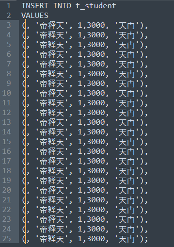
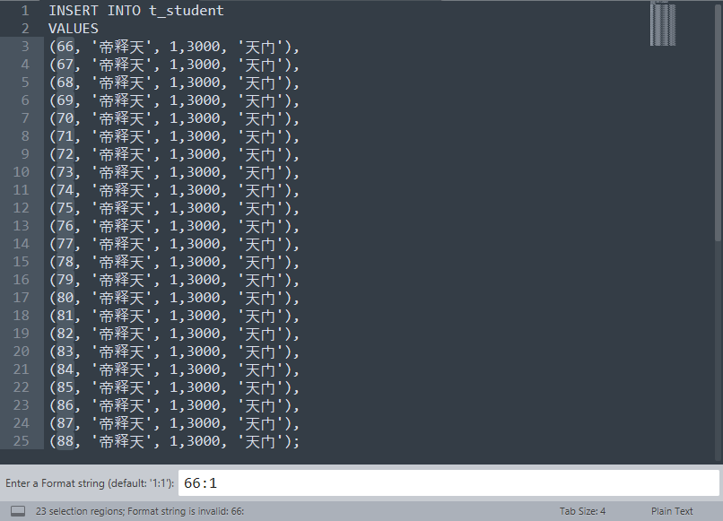

## 如何在多行前面快速插入序号

* 1）需要安装`InsertNums`插件

首选项 -> `Package Control` -> `Install Package` -> `InsertNums`

* 2）使用快捷键 `Ctrl` + `Alt` + 方向键(上、下、左、右) 生成多行光标

`Ctrl` + `Alt` + N 生成序号，编辑器下方出现提示和输入框，默认配置“1:1”（从1开始，步长为1）。可在输入框内，手动输入配置，如 101:1（从101开始，步长为1），若初始时选中了10列，效果便是101/102/.../109/110

* 3）例子

**`Ctrl` + `Alt` + 方向键下 产生多行光标**

**`Ctrl` + `Alt` + N 生成序号**

