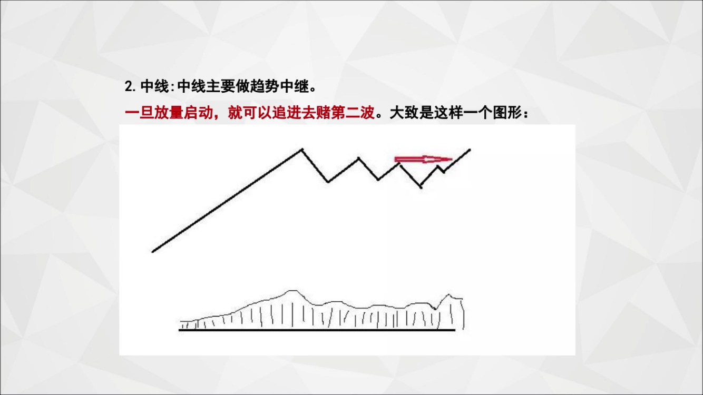
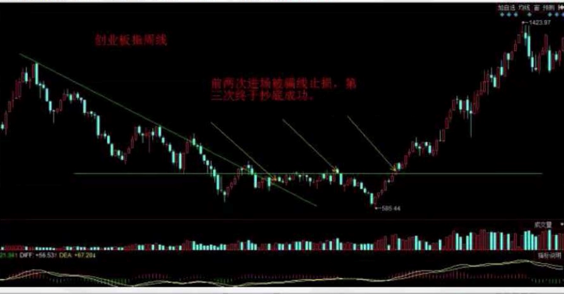

# 职业操盘手讲座：炒股入门10堂课

## 前言
**思考：你的钱应该放在哪？**
* `存银行`利息太低实在`抵抗不过通货膨胀`；
* `买理财`产品要么收益也低要么`不安全`；
* `投实体`不仅操劳生意也比较`难做`；
* `投房地产`资金要求大还有`变现不方便`；

**思考：为什么要炒股？**
拿出部分到股市，算是一个相对还行的`理财和保值增值途径`；
毕竟长期来看，通过股市，可以`分享国家经济发展所带来的红利`；

**思考：我们到底如何才能从股市赚到钱呢？**

**利弗莫尔《股票大作手操盘术》开篇写到：**
> 
> 投机，天下彻头彻尾最富魔力的行当。但是，这行当愚蠢的人不能干，懒得动脑子的人不能干，心理不健全的人不能干活，企图一夜暴富的冒险家不能干。这些人如果贸然卷入，到头来终究会一贫如洗。
> 
> 很多年来，每当我出席晚宴的时候，只要有陌生人在场，他们中几乎总有人走过来坐到我身边，稍作寒暄便言归正传：“我怎样才能从市场上挣些钱？”
> 
> 当我还年轻的时候，会不厌其烦地设法解释，期盼从市场上既快又不费事地挣钱是不切实际的，你会碰上如此这般的麻烦；或者想尽办法找个礼貌的借口，从困境中脱身。最近这些年，我的回答只剩下生硬的一句：“不知道。”
> 
> 碰上这种人，你很难耐得住性子。其他先不说，这样的问法对于一位已经将投资和投机作为事业，并对其进行了科学研究的人来说，实在算不得什么恭维。要是这位外行朋友也拿同样的问题请教一位律师或外科医生，那才叫公平：“我怎样才能从法律事务或外科手术上快快挣钱？”
> 
> 话说回来，我到底还是认定，对于有志于在股票市场投资或投机的大多数人来说，如果有一份指南或者路线图为他们指出正确方向的话，他们是愿意付出汗水和研究来换取合理回报的。本书正是为这些人写的。

## 第一课：何时买股
### 第一部分：买股、卖股和仓位

**选择比努力更重要**

不是所有时候都适合入场买股票。`一段时间里，每天有70~80%的股票是上涨的，而有段时间每天70~80%是下跌的`，你说哪段时间更容易赚钱，哪段时间更容易亏钱？

结论：
* `方向错了，跑得越快只会离目标越远`
* `跟着大概率，赚点轻松钱`

**交易是一个概率游戏**
2015年两轮股灾期间动辄指数跌幅超过5%，千股跌停，这时买股大概率亏钱；

**选择入场时机的方法很多，主要分三步**：

1）`确定需要的指数`；

* 主要参考四个指数：`上证指数、深证指数、创业板指、中小板指`；
* 2015年行情最好时，创业板指走势最犀利，如果`参与其中强势板块效率最高`，可能还会用到上证50、沪深300、中证500、创业板综等指数作为辅助；

2）`确定衡量指数强弱的指标`；

* 最简单的办法是用均线来衡量：常用`20日、30日或者60日均线`，适用于做中线波段，也比较适用于大多数上班族；
   * `单根20日均线拐头进出场`：K线在均线下空仓、均线上开仓；
   * `均线交叉判断法`：20日均线和60日均线交叉进出场；
* `线上或者金叉并不代表市场必涨，线下或者死叉也并不代表市场必跌，都只是代表一种大概率`；

3）`确定已有强势领涨的板块`；

* 要关注强势板块里，哪些是比较明显的龙头品种；
* `最佳操作的目标`：本次启动最早、涨得最猛的，视为这波行情的龙头；

**顺势而为：**
* `交易是一门等待和放弃的艺术`；
* `会休息的人才能更好的工作，所以择时不仅重要而且必要`；

## 第二课：买什么股
### 第一部分：短线、中线和长线

#### **短线**：`短线主要做情绪波动`

做强势股，做龙头。（当年的中国一重）

**短线目标有哪些特征**：

1、突然成交量增加几倍；

2、涨得很急，基本飚直线；

3、过程中涨停板是少不了的；

实例：美联新材

* “`堆量飙涨+缩量回调+再度放量涨停攻击`”，符合短线交易原理

#### **中线**：`中线主要做趋势中继`

`一旦放量启动，就可以追进去赌第二波`。大致是这样一个图形：

实例：卫宁软件

* 刚好赶上行情好（属于指数线上作业范围内），往上就自然而然。

**趋势中继的几种形态变化**

1）`失败的M头（或者失败的三重顶）`

* 这是中继过程中最常见的调整形态；

2）欧氏“杯柄”

* 整个形态应该是上涨放量、下跌缩量的。用周线图看可能更清晰（达安基因周线图）。

3）高位紧密旗形

* 这是一种比较高效的短中线中继形态。这种形态非常罕见，但是成功率和效率相对较高，有点可遇不可求。

`一个结论：三种形态不管调整过程中什么变化，但总体结构就是简单的“趋势中继”，符合“上涨+调整+再次上涨”的结构要求`。

#### **长线**：`长线主要做趋势转折`

特别提醒，`不要在一波大行情开启很久以后去做长线，或者一波大行情刚结束不久去做长线，一定要捡便宜`；

**第二种方法：用年线拐头判定**

* 股票均线其实就是天然的趋势线，只不过是曲线。一般认为，当均线出现年线（250日均线）级别转折时，长期趋势也开始发生变化；

`没有机会的时候，不要将就，不要随意买`；

* 一则没什么油水搞不好还亏钱，无谓损失本金；
* 二则随意买票真正机会到来时手里没钱，浪费机会；

`不如干脆休息，一年等到几次机会就够了`；

## 第三课：如何止损
### 第一部分：卖股票可以简单分类为：止损和止盈

**止损的主要方式大致有4种：**

1）绝对跌幅止损：比如买入股票后亏损8%（或者7%、9%、10%都可以）无条件出局；

2）依托支撑位止损：在支撑位（股票盘整所产生的成交密集区）上面买入的股票，如果跌破支撑位，就可以考虑先出局了；

3）依托均线止损；

4）基于时间的止损：这种方式主要在追击突破股的时候使用；

`优先保住本金，往往比追求盈利更重要；`

每次买股票之前，都先想好止损位设在哪里。如果没想好，最好1股都不要买。止损说起来容易做起来难，因为它是逆人性的；
* 没道理跌的，这是主力在挖坑；
* 大盘最近好像不错，它也许会跟涨；
* 已经跌了这么多（久），反弹是大概率；
* 本来该卖，可感觉现在有点跌不动了；
* 确实该卖了，但是等小反弹时再卖吧，稍微少亏点；
* 再多看一天吧，明天再不行再抛...... 

**下跌加码：让人用最快速度把钱亏光的最好办法之一。**
2008年死得最惨的，不是那种买在顶部的，而是那种越跌越补的；

`第一次下注没有获利之前，不允许加注，因为如果下注是正确的，你应该会赚钱。既然你第一次飞往没有判断准，凭什么觉得第二次判断就会变准？`

>  `切记切记：无止损，不交易！`

**止损对于交易非常重要，还想强调两点：**

1）`目光一定要长远`；

* 你买的股票套了，不肯认错，无非是希望、侥幸它再涨回来，那你认错后再搞一个不就得了；

2）要站在交易之外看交易；

* 你骗得了自己，骗不了自己的账户；

“`盈利是对好的性格的奖赏。`”

## 第四课：如何止盈
止损难，其实止盈更难做好。总体原则是：
* `对于买对的票，尽量拿久一点赚多一点`；
* `尽量保护好已经到手的利润，不要出现太大的回吐`；

### 第一种：动态止盈
随着股价不断抬升，逐步有节奏提高卖出股票的价格；

动态止盈做法演示：
1）刚买入的时候，在下面8%设止损点；
2）如果买后涨了5%（一般用收盘价衡量）以上，股份回撤10%坚决出局；
3）浮盈达到10~12%以上的股票，如果跌回成本价，都先无条件卖出；
4）到了后面随着盈利慢慢增加，逐步提高出局点的价格，但是允许回撤的空间越来越大；

还有一种变通的做法，浮盈比较大以后可以不看回撤的幅度，就盯住30日或60日均线（根据你自己对回撤的接受程度选择），`均线不破，一股不让`；

**截断亏损，让盈利奔跑**
可以在股票出现连续加速上攻，偏离20日均线过远的时候，先卖出一半；

### 第二种：和买点对应的一致性止盈
* 什么样周期的买点对应什么周期的卖点；
* 不要怕回撤，不要去追求精致，追求一致性；

牢牢记住两点：
* 一是股票不管怎么卖都会有遗憾，找个一致性规则，严格执行、坦然授受就是；
* 二是千万不要追求把股票卖在最高点，你会失望的，我们只追求大概率，尽量吃足鱼的身体；

## 第五课：仓位配置

**区分老司机和新菜鸟，看仓位配置，或者说是仓位管理**

一把梭，看起来很酷，实际背后蕴藏的风险很大；面对连续跌停的股票，如果全仓持股，跑都跑不掉，会遭受巨亏；

2008年金融危机时的铜期货，连续五个跌停；如果满仓，开板时已经亏光；要是多犹豫下（重仓很容易导致动作变形），第二天强平反过来会欠期货公司一身债；

如果我们在市场的时候足够长，这种极端情况总有天可能遇到。很多时候，这种损失是致命的。因为不管以前盈利多少，翻了多少倍，资金清零的速度都一样，只需要亏一个100%，或者只要遭遇一次腰斩，几个月甚至一两年的利润便短时间内全部回吐。

`通过仓位配置，来避免这种辛辛苦苦好多年，一夜回到解放前的情况；`

`股票买多少仓位，取决于：交易者每次最多愿意亏损多少资金。`

**业内比较认可的：是每次交易对本金带来的损失控制在2%左右；**

计算每个股票可以买多少数量的公式：
* 最多买入股数 = (总资金*2%)/(买入价-止损价)
* 假设总资金100万，买入价10元，9元止损（亏10%），那么这个股票最多能买：(1000000*2%)/(10-9) = 20000股
* 假设总资金100万，买入价50元，46元止损（亏8%），那么这个股票最多能买：(1000000*2%)/(50-46) = 5000股

**仓位配置的第一原则：不能太集中也不宜太分散**
* `不要让自己在单笔交易中亏太多的钱，也不要明明抓住一个大牛股却对总资金增加贡献太小；`

**仓位配置的第一原则：初始账户一定要做安全垫**

* 要把`保住本金`放在第一位，`仓位控制的背后是情绪控制`；

**盲目重仓的坏处：**

1）导致交易者心态发生变化；

2）无法很好执行自己的操作计划；

`我们在市场中，总会遇到各种意外，因此我的交易总是非常谨慎，每次下注都会有所节制。`

单票重仓——让人无法理解！
* 单票重仓目的和意义何在？无非就是又想偷懒又想捞一票暴利，想毕其功于一役，侥幸心理、赌徒心理在作祟。

`不要轻易重仓某个股票，并且一定要记得严格止损。`

## 第六课：如何复盘
**问题**：A股市场现在3000多支股票，怎样才能快速找到符合交易条件的股票呢？
**高端复牌**：教大家每天大概只需要做一小时左右的功课，就能在目标出现时准确捕捉到。

**为什么要复盘？**

1）`寻找可能交易的目标`；

2）`保持对市场的感觉`；

如何通过复盘来找到可能交易的目标，和每个人的交易模式密切相关。
`不同的交易模式，需要不同的复盘方法。`

**强势股怎么找？**

1）`每天都要扫一遍涨幅榜（涨幅超过5%），特别是涨停的票`；

2）`寻找最近一段时间涨得比人家好的`。

* 比如：使用问财搜索“最近20个交易日涨幅大于30%”

`强势股还有一个特征，就是股价不断创历史新高。`
`还有一种判断强势股的方法：市场出现重要低点以来，他是领涨的。`

**通过上面这些方法，基本能找到：**
* `一个月以来涨得最好的票`；
* `重要低点以来涨得最好的票`；
* `股价不断在创新高的票`；

`大部分强势股，基本都包含在里面了。`然后，再放在一个池子里，跟踪调整时的表现，视情狙击。`另外，跌幅榜一定要翻看`。

建自选池分两步：`先设置一个过滤池，相当于通过海选的同学，可以呆在过滤池里，每隔一段时间翻翻看，一些后续走得好的，再进入自选池。`

**自选池里的票也分两部分：**

1）随时可能出现买点的票；

2）用来监控市场、感知市场的票；

**下面做个简单归纳：**

1）目的决定行为

* 首先得审视，自己的交易方法，需要找到哪些目标，然后认真研究这些目标的共同特点，抓住这个共同特点（关键词）去寻找潜在的对象；

2）行动贵在坚持

* 如果三天打鱼晒网，很有可能偏偏就是休息那几天错过了交易信号；

3）坚持需要方法

* 盲目坚持不但用处不大，而且可能到后面也坚持不下去。我们得确保自己每天做的功课，如果遇到可以交易的股票，一定是能够发现的。以前我和人家开玩笑：童话的结局往往是“从此王子和公主过上了幸福的生活”，那么假设王子和公主一辈子没遇到过，他们再般配，也没法过上幸福的生活啊。所以，遇到很重要。

**复盘的基本道理：**

1）先明确自己是如何做交易的；

2）这样做交易，买入目标具有哪些共性；

3）自己所用的行情软件，能够提供哪些筛选功能；

4）如何确保自己每天的复盘操作，能够覆盖自己可能交易的目标；

## 第七课：如何建立交易系统
### 为什么要建立交易系统
* 首先，基于经验的操作是不可靠的，历史会重复，但细节会变化；
* 其次，人一定是有情绪的，不管修为多好；

### 如何建立交易系统
1）`只在什么样的时候买股票`。一旦规定下来，其余时候，就应该一动不动；

2）`只买什么样的股票`。一旦规定下来，其余的股票再花枝招展、风情万种，也不应该碰；

3）`每次只买多少`。一旦规定下来，你就失去随心所欲的权力；

### 系统示范
`坚持“保本第一”，只参与符合系统的机会，追求长期稳定收益。`

**一、总体思路：顺势、轻仓、止损、持盈**

1）`顺势`：相关大盘指数运行在年线和20日均线之上并出现共振，且未出现典型顶部特征（M顶、头肩顶等）；

2）`轻仓`：底仓每次买入总资金的1/5（本金没有安全垫时1/6）；如走势符合预期，可在第一次缩量回调时依托20日均线等额加码；

3）`止损`：底仓买后亏损8~10%即清仓（根据波动不同）；如收盘浮盈超过5%开始移动止损（盈利到过12%后不允许再出现亏损）；加码部分可以5~6%的窄止损；

4）`持盈`：一般根据20日均线持股；如为井喷主升浪盈利40%后可止盈一半；

**二、具体标的：趋势中继型、趋势转折型**

1）`趋势中继型`：可以定下来几种买点；

2）`趋势转折型`：经过`一年半以上长期下跌`或`盘整后股价放量破年线`；缩量回调年线后再度拉起（从突破到回调不少于2个月，突破后的涨幅不超过35%），年线开始走平上翘；

**三、注意事项**

1）做好常规功课

* 建好自选池：按照有关形态特点建立初选池，初选池精选后和部分指标股、指数行业基金形成自选池；
* 坚持复盘：
   * 每天晚上，查看涨跌幅榜（行业、个股），自选池，搜索价格创两年新高的股票、近20个交易日涨幅15~30%的股票；
   * 每周末，查看一周、一月、一季，以及重要低点以来强势个股（行业）；

2）严格交易计划：所有交易必须在上午或下午开盘前已计划好，杜绝盘中随意开仓；

**交易系统建立，一般要经历三个阶段：逻辑验证、数据回测、小仓测试；**

`不要以为了有交易系统，从此以后就可以笑傲股市，拥有一个自动提款机了`；`交易道路上的“知”和“行”，每取得一点进步，都需要付出大量时间和精力`；
* `大周期找趋势，小周期找入场点`；
* 操作周期不要太小，避免频繁交易；市场的波动就像大海里的波浪，容易把你打进水里，做趋势要尽量避免小波动的伤害；
* `移动止损，不要把有一定盈利的单子做成亏损`；

系统的优化磨合这个阶段非常地漫长和痛苦。因为和一开始相比，你的交易经验汲取的速度逐渐放缓。这个过程中，或许你已经可以做亏损的很慢很少，但你还是在慢慢的死亡；对于我来说，这个阶段已经没有了顿悟，有的只是水到渠成的缓缓领悟；对市场，对系统，对自身，已经记不清中间的突破，只知道当时自己痛苦并坚强着；

`哪怕构建和执行交易系统的过程再痛苦，也不要依靠盘感去交易`。盘感是非常靠不住的；
* 系统的重要性：做了5年以上的老鸟都有体会，开始都靠盘感做，但亏疼了后发现灵感远不如系统来的稳定，盘感会无限放大人的弱点，而人性是我们无法抵触的，只有用系统来规则；如果新手的你一定要在靠灵感在交易的话，现在必须开始着手构建你自己的系统！（你不信？一开始我也不信，但时间和钞票会改变你的想法 ）；

## 第八课：如何做好执行
**做好交易什么最难？执行最难！**

### 一、用两个账户

或者把一个账户里的钱固定分成两部分，`一部分按自己感觉做`，`一部分按照交易规则做`。然后时间长了有个比较，能够帮助我们更好做出选择。

`交易里的悖论`：就是正确的方法，经常也会亏钱，而错误的方法，经常也能赚钱；

另外，`人是有选择性记忆的`，我们会很快忘记伤害，所以一个熊市可能无限放大你的错误；

### 二、整理一些简单的纪律要求

`牢记不要在下跌时补仓`

另外两条：
* 一是：`永不做日内T+0`
   * 道理也很简单，用很少钱玩，亏得当然少，但是赚得也少，我干嘛要去做这个呢？
* 二是：`永不追高`，在炒股过程中，一旦错过买点，坚决放弃；
   * 提示一点：“突破买入”和“追高”是有本质区别的。

### 三、注意仪式感
* 敬畏市场。坚持被动交易、定式交易，永远把保住本金放在第一位；
* 计划交易。每天写复盘日记，静态阅读市场。每个买卖决定对照交易模型审视确定，并排写计划表；
* 交易计划。盘前15分钟检查软硬件和盈损点。盘中不许临时起意，挂单撤单干脆不犹豫。尽量使用隔夜挂单；
* 加强保障，生活节律，保证专注度；

### 四、经常性阅读学习
有一些经典书籍，结合我们的交易实践，每一次重温，都会有新的感触，可以帮助我们以后更坚定地执行。

学习真的是一种必需品，其实也是一种乐趣。

### 五、循序渐进
由易入难去改、一个一个去改；

### 六、寻找榜样
管理学中最经典常用的方法：典型引路

### 七、注重生活

### 八、要有追求和信念

## 第九课：推荐10本好书
《炒股的智慧》（作者：陈江挺）
《股票大作手回忆录》（作者：埃德文.拉斐尔）
《股票大作手操盘术》（作者：杰西.利弗莫尔）
《股市趋势技术分析》（作者：爱德华兹、迈吉）
《笑傲股市》（作者：威廉.欧奈尔）
《通向财务自由之路》（作者：范.K.撒普）
* 推荐理由：这是本手把手教人如何构建交易系统的书。它像一根绳子，可以把你所学的理论和技术，以及在市场中花了很多时间很多金钱换来的经验，全部有机串联起来，并且提供多种方案供读者选择，介绍多位大师的方法供读者借鉴；

《走出幻觉走向成熟》（作者：金融帝国）
* 推荐理由：该书作者深入浅出，从哲学、逻辑的角度阐述了很多本质的东西，既有助于读者进一步认识交易和市场，又不失可读性。

《亚当理论》（作者：威尔斯.威尔德）
* 推荐理由：本书最大优点是可以帮助我们培养好的心态；
* 作者说：从事交易不需要了解太多，比你看到的还要少。阻碍我们在市场上成功的，并非我们对市场不够了解，而是我们懂得太多。我们要能够忘记自以为懂得的一切知识，才能更好地“看清楚真正发生的事。我们必须让自己反映市场、追随市场、屈从于市场。 

## 第十课：风险教育
每一名严肃的交易者，都应该把风险控制放在第一位！

`从股市的设计来看，它是一个零和，甚至是负和游戏；`
* `股市本身不产出任何利润，只会抽取股民的财富`（佣金和印花税）。所以炒股要赚钱，全靠新来的资金推动，是一个击鼓传花的游戏；

`从投机的角度来看，炒股具有亏起来快赚起来慢的风险；`
* 一个股票从10元涨到20元，第一个涨停只涨1元，20元跌到10元，第一个跌停板会跌2元。涨起来总是先慢后快，跌起来总是先快后慢；

`炒股具有业余选手和专业选手一起战斗的风险；`
* 炒股赚钱难，因为你的对手是专业的；

`导致炒股容易亏钱还有个原因，就是错误的方法也能赚钱，甚至在一段时间里持续让你赚大钱，从而容易养成错误的思维习惯和交易方式；`
* 牛市里赚钱的方法大熊市里可能让你亏得很惨；
* 验证一个交易方法是否直的适用需要太多时间。理论上要经历`一轮牛熊（8-10年）`到`两轮牛熊（15年）`以上，很多经验才靠谱；

`投机游戏是逆人性的，人性的弱点是交易最大的风险；`
* 人的心态`总是想尽量保住胜果`；
* 人的心态`总是不愿意认输`，那样会感觉自己没能力，套牢以后，会丧失太多的机会成本；

**人性的弱点还有其他一些表现**
* `一是缺乏耐心`；判断对方向，但是不能等到关键点，过早下注；
* `二是急功近利，常年满仓`；只能说这是人性的弱点，人性的贪婪把这些人的智商拉下来了。
* `三是赌性重，单票盲目重仓`；这主要会带来两个风险：
   * 第一个，可能会遭遇连续跌停的黑天鹅；
   * 第二个，这种方式很容易让你太快失去本金；
* `四是不合理的预期`；一定要降低预期，预期高了，你就会常年满仓、单票重仓、高频交易，不肯认错；

`一定要首先认识到，一旦进入股市，风险就无处不在，来市场的人都不是善男信女，他们都盯着你口袋里的钱。只有首先认识到股市赚钱很难，存在一种敬畏的心理和时刻保持警惕的心态，才能做好交易。`

有些人不理解这个交易的“道”，穷尽毕生精力去追求技术分析这种末端的“术”，眼界和格局注定一辈子难以入门。

**那么具体我们应该怎么做呢？**

股神巴菲特曾经说过，**投资最重要的三件事**是`不要亏钱`、`不要亏钱`、`不要亏钱`；

* 正如费思在《海归交易法则》中“生存第一法则”所说的：`交易的首要目标应该是生存。时间站在我这边，一个期望值为正的系统或方法早晚会给你带来财富，有时候是你做梦也想不到的巨大财富。但这一切有一个前提条件——你必须留在游戏场中。`对交易者们来说，死亡有两种形式：一种是痛苦的慢性死亡，足以让交易者们在苦闷和沮丧中放弃交易；另一种是戏剧性的快速死亡，我们称为崩溃；
* 大多数新手都会高估自己承受痛苦的能力，他们自以为能承受30%或者40%（甚至50%、70%）的衰落，其实他们不能。这对他们交易有极端不利的影响，因为这通常会导致他们彻底放弃交易，或是在遭受了衰落期中的重大损失后慌忙改变策略，而这恰恰是最不应该改变策略的时候。

**要实现本金到利润这个目标，需要做好四个方面：**

1）`每次只拿资金的一部分买入某个股票`，确保这部分资金即使遇到重大意外被腰斩，80%以上的本金还在；

2）在刚入市还没有利润的时候，`用比平时更轻的仓位去试探市场`，慢慢积累一些盈利作为安全垫；

3）`及时止损，不要放任亏损扩大，也不要轻易对亏损的股票去加码摊薄成本`。有句俗语叫做：早点不割肉，晚点要割蛋；

4）`适当减少交易频率`，以免在不好的行情中，或者在一连串低质量的交易中连续出现小亏损，积累成为大亏损；