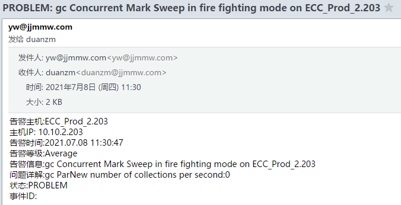

最近频繁收到生产ECC项目的GC告警邮件，同时清算人员反馈ECC系统无法正常访问，大部分时候等待几分钟后系统可自行恢复正常，初始定位问题是系统发生full gc导致系统暂时不可用；


### JVM和GC参数配置如下

```bash
#查看JVM参数配置
[tomcat@ecc opt]# jps -v
-XX:+UseConcMarkSweepGC -Xmx6144m -Xms4096m -XX:PermSize=256M -XX:MaxPermSize=512M -Xms8m

#-Xmx6144m -Xms4096m：Heap堆内存最小为4G，最大为6G
#-XX:PermSize=256M -XX:MaxPermSize=512M：永久代内存初始大小为256M，最大为512M
#-Xms8m：线程栈内存大小为8M
#-XX:+UseConcMarkSweepGC：使用CMS垃圾回收器
```

### 查看堆内存使用情况

使用`jmap -heap [pid]`查看堆使用情况

* 堆内存最大为6144M
* 新生代内存大小为665M，老年代内存大小为1331M
* NewRatio = 2，默认配置，老年代和新生代内存占比为2:1，老年代为堆内存的2/3，新生代为堆内存的1/3；
* SurvivorRatio = 8，默认配置，Eden:Survivor TO:Survivor From=8:1:1，Eden区占新生代的8/10，两个Survivor区分别占新生代的1/10；

```bash
#使用jmap查看堆使用情况
[tomcat@ecc opt]# jmap -heap 41576
Attaching to process ID 41576, please wait...
Debugger attached successfully.
Server compiler detected.
JVM version is 24.80-b11

using parallel threads in the new generation.
using thread-local object allocation.
Concurrent Mark-Sweep GC

Heap Configuration:                            #堆内存初始化配置
   MinHeapFreeRatio = 40                       #堆最小空闲比率
   MaxHeapFreeRatio = 70                       #堆最大空闲比率
   MaxHeapSize      = 6442450944 (6144.0MB)    #堆最大大小
   NewSize          = 697892864 (665.5625MB)   #堆新生代的默认大小
   MaxNewSize       = 697892864 (665.5625MB)   #堆新生代最大大小
   OldSize          = 1395851264 (1331.1875MB) #老年代大小
   NewRatio         = 2                        #新生代和老年代的大小比率
   SurvivorRatio    = 8                        #年轻代中的Eden区与Survivor区的大小比率
   PermSize         = 268435456 (256.0MB)      #永久代的初始大小
   MaxPermSize      = 536870912 (512.0MB)      #永久代的最大大小
   G1HeapRegionSize = 0 (0.0MB)

Heap Usage:                                    #堆内存使用情况
New Generation (Eden + 1 Survivor Space):      #新生代
   capacity = 628162560 (599.0625MB)           #容量
   used     = 472997696 (451.08575439453125MB) #已使用容量
   free     = 155164864 (147.97674560546875MB) #空闲容量
   75.29861314880021% used                     #使用比率
Eden Space:                                    #新生代的Eden区内存分布
   capacity = 558432256 (532.5625MB)
   used     = 469345784 (447.60301971435547MB)
   free     = 89086472 (84.95948028564453MB)
   84.04704043456974% used
From Space:                                    #新生代的其中一个Survivor区内存分布
   capacity = 69730304 (66.5MB)
   used     = 3651912 (3.4827346801757812MB)
   free     = 66078392 (63.01726531982422MB)
   5.2371950077831295% used
To Space:                                      #新生代的另一个Survivor区内存分布
   capacity = 69730304 (66.5MB)
   used     = 0 (0.0MB)
   free     = 69730304 (66.5MB)
   0.0% used
concurrent mark-sweep generation:              #老年代内存分布
   capacity = 3597074432 (3430.4375MB)
   used     = 380603000 (362.97130584716797MB)
   free     = 3216471432 (3067.466194152832MB)
   10.580904209657456% used
Perm Generation:                               #永久代内存分布
   capacity = 268435456 (256.0MB)
   used     = 93387224 (89.06099700927734MB)
   free     = 175048232 (166.93900299072266MB)
   34.78945195674896% used

55061 interned Strings occupying 6281928 bytes.
```


### JVM内存统计

此次内存监控的统计数据开始监测时间点：2021-07-13 15:00:00（上次发生告警后，重新发布系统重启服务的时间），从JVM内存监控统计数据来看，不到24小时的运行时间内，JVM发生了291次Young GC，4次Full GC。从JVM内存使用情况和GC频次来看，年轻代、S0和S1的内存配置过低，导致频繁触发Young GC，S0和S1内存过低频繁GC后系统只能迁移到老年代，老年代占满后系统触发Full GC；

```bash
#查看JVM内存使用情况
[tomcat@ecc opt]# jstat -gcutil 41576  1000 10
  S0     S1     E      O      P     YGC     YGCT    FGC    FGCT     GCT   
  0.00  48.51  92.35  50.17  34.94    291   20.892     4    0.798   21.690
  0.00  48.51  92.56  50.17  34.94    291   20.892     4    0.798   21.690
  0.00  48.51  92.56  50.17  34.94    291   20.892     4    0.798   21.690
  0.00  48.51  92.76  50.17  34.94    291   20.892     4    0.798   21.690
  0.00  48.51  92.76  50.17  34.94    291   20.892     4    0.798   21.690
  0.00  48.51  92.97  50.17  34.94    291   20.892     4    0.798   21.690
  0.00  48.51  92.97  50.17  34.94    291   20.892     4    0.798   21.690
  0.00  48.51  93.17  50.17  34.94    291   20.892     4    0.798   21.690
  0.00  48.51  93.17  50.17  34.94    291   20.892     4    0.798   21.690
  0.00  48.51  93.38  50.17  34.94    291   20.892     4    0.798   21.690
  
#查看JVM内存各代容量以及使用量  
[tomcat@ecc opt]# jstat -gc 41576  1000 10
 S0C    S1C    S0U    S1U      EC       EU        OC         OU       PC     PU    YGC     YGCT    FGC    FGCT     GCT   
68096.0 68096.0  0.0   33034.4 545344.0 512073.6 3512768.0  1762180.8  262144.0 91601.8    291   20.892   4      0.798   21.690
68096.0 68096.0  0.0   33034.4 545344.0 513262.5 3512768.0  1762180.8  262144.0 91601.8    291   20.892   4      0.798   21.690
68096.0 68096.0  0.0   33034.4 545344.0 513262.5 3512768.0  1762180.8  262144.0 91601.8    291   20.892   4      0.798   21.690
68096.0 68096.0  0.0   33034.4 545344.0 514441.1 3512768.0  1762180.8  262144.0 91601.8    291   20.892   4      0.798   21.690
68096.0 68096.0  0.0   33034.4 545344.0 514441.1 3512768.0  1762180.8  262144.0 91601.8    291   20.892   4      0.798   21.690
68096.0 68096.0  0.0   33034.4 545344.0 515639.7 3512768.0  1762180.8  262144.0 91604.5    291   20.892   4      0.798   21.690
68096.0 68096.0  0.0   33034.4 545344.0 515639.7 3512768.0  1762180.8  262144.0 91604.5    291   20.892   4      0.798   21.690
68096.0 68096.0  0.0   33034.4 545344.0 516829.7 3512768.0  1762180.8  262144.0 91604.c5    291   20.892   4      0.798   21.690
68096.0 68096.0  0.0   33034.4 545344.0 516829.7 3512768.0  1762180.8  262144.0 91604.5    291   20.892   4      0.798   21.690
68096.0 68096.0  0.0   33034.4 545344.0 517983.2 3512768.0  1762180.8  262144.0 91604.5    291   20.892   4      0.798   21.690
```

```bash
#查看JVM内存使用情况
[tomcat@ecc opt]# jstat -gcutil 41576  1000 10
  S0     S1     E      O      P     YGC     YGCT    FGC    FGCT     GCT   
 20.29   0.00  57.16  50.63  34.99    292   20.926     4    0.798   21.724
 20.29   0.00  57.16  50.63  34.99    292   20.926     4    0.798   21.724
 20.29   0.00  57.36  50.63  34.99    292   20.926     4    0.798   21.724
 20.29   0.00  57.36  50.63  34.99    292   20.926     4    0.798   21.724
 20.29   0.00  57.57  50.63  34.99    292   20.926     4    0.798   21.724
 20.29   0.00  57.57  50.63  34.99    292   20.926     4    0.798   21.724
 20.29   0.00  57.78  50.63  34.99    292   20.926     4    0.798   21.724
 20.29   0.00  57.78  50.63  34.99    292   20.926     4    0.798   21.724
 20.29   0.00  57.99  50.63  34.99    292   20.926     4    0.798   21.724
 20.29   0.00  57.99  50.63  34.99    292   20.926     4    0.798   21.724

#查看JVM内存各代容量以及使用量  
[tomcat@ecc opt]# jstat -gc 41576  1000 10
 S0C    S1C    S0U    S1U      EC       EU        OC         OU       PC     PU    YGC     YGCT    FGC    FGCT     GCT   
68096.0 68096.0 13814.2  0.0   545344.0 129809.0 3512768.0  1778518.8  262144.0 91697.2    292   20.926   4      0.798   21.724
68096.0 68096.0 13814.2  0.0   545344.0 129809.0 3512768.0  1778518.8  262144.0 91697.2    292   20.926   4      0.798   21.724
68096.0 68096.0 13814.2  0.0   545344.0 131273.5 3512768.0  1778518.8  262144.0 91697.7    292   20.926   4      0.798   21.724
68096.0 68096.0 13814.2  0.0   545344.0 131509.4 3512768.0  1778518.8  262144.0 91697.7    292   20.926   4      0.798   21.724
68096.0 68096.0 13814.2  0.0   545344.0 132683.3 3512768.0  1778518.8  262144.0 91697.7    292   20.926   4      0.798   21.724
68096.0 68096.0 13814.2  0.0   545344.0 132730.3 3512768.0  1778518.8  262144.0 91697.7    292   20.926   4      0.798   21.724
68096.0 68096.0 13814.2  0.0   545344.0 133919.0 3512768.0  1778518.8  262144.0 91697.7    292   20.926   4      0.798   21.724
68096.0 68096.0 13814.2  0.0   545344.0 133919.0 3512768.0  1778518.8  262144.0 91697.7    292   20.926   4      0.798   21.724
68096.0 68096.0 13814.2  0.0   545344.0 135112.1 3512768.0  1778518.8  262144.0 91697.7    292   20.926   4      0.798   21.724
68096.0 68096.0 13814.2  0.0   545344.0 135112.1 3512768.0  1778518.8  262144.0 91697.7    292   20.926   4      0.798   21.724 
```

