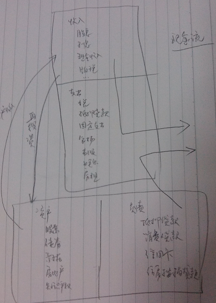

# 富爸爸穷爸爸

## 目标

了解`会计&投资基本知识`，锻炼`财商智慧`
* 财商是在解决财务问题的过程中锻炼出来的

了解什么是收益表和资产负债表，以及它们之间的关系

了解钱的运动规律

安全/聪明地理财

`做个努力工作的雇员，确保你的工作，但要不断构筑你的资产项`

## 理财观念

穷人
* 我可付不起——意味着精神上的懒惰，你的大脑会停止思考
* 逃避钱的问题

富人
* 我怎样才能付得起？——让你大脑动起来
* 想办法解决钱的问题

`学习金钱的课程（研究钱的运动规律，让钱为你所用）`

## 第一课 穷人和中产阶级为钱工作，富人不为钱工作

关于钱，没有激情，只有恐惧

对于钱的无知导致了恐惧和欲望

没钱的恐惧促使努力工作，得到报酬后，欲望让我们拥有所有用钱能买到的好东西

钱就是驴子面前的胡萝卜，而梦想得到汽车、房子等就相当于胡萝卜

## 第二课 财务知识

`重要的不是你挣了多少钱，而是你能留信多少钱，以及能够留住多久`

如果你想发财，就要学习财务知识

**致富唯一规则：你必须明白资产和负债的区别，购买资产**

* 富人得到资产，而穷人和中产阶级得到负债
* 如果你想富有，就必须读懂并理解那些财务会计数字

**资产是什么？**

* `资产是能把钱放进你口袋里的东西`
* 股票/债券/票据/房地产/知识产权等

**负债是什么？**

* `负债是把钱从你口袋里取走的东西`
* 抵押贷款/消费贷款/信用卡/住房按揭贷款

**现金流**

**理财态度**

* 在你赚钱之后如何处理这些钱？
* 怎样防止别人从你手中拿走这些钱？
* 你能拥有这些钱多久？
* 如何让钱为你工作？

**为什么会陷入财务的困境？——收入增加、支出增加、负债增加**

* 你选择的消费方式（贷款消费）
* 在财务上的无知以及不理解资产与负债的区别

**自知的力量**

* `害怕与别人不同`
* 害怕在公众面前说话是因为害怕被排斥、害怕冒尖、害怕被批评、害怕被嘲笑、害怕被别人所不容

**为什么富人越来越富？**

资产项产生的收入足以弥补支出，还可以用剩余的收入对资产项进行再投资。资产项不断增长，相应的收入也会越来越多

**什么是财富？**

* 财富就是支撑一个人生存多长时间的能力，或者说，如果我今天停止工作，我还能活多久？
* 财富是将资产项产生的现金与支出项流出的现金进行比较而定的
* 把支出控制在资产项能够产生的现金之下，就会越来越富有，也会有越来越多的非劳动收入

## 第三课 关注自己的事业

#### 资产分类

1. 不需要你到场就可以正常运作的业务
   - 我拥有它们，但由别人经营和管理。如果我必须在那儿工作，那它就不是我的事业而是我的职业了

2. `股票`

3. 债券

4. `共同基金`

5. 能够产生收入的房地产

6. 票据(借据)

7. 版税，如音乐、手稿、专利

8. 任何其他有价值，可产生收入或可能增值并且有很好的流通市场的东西

购买小公司股票，投资策略——一年内脱手

`继续工作的同时，关注自己的事业——建立自己牢固的资产`

购买奢侈品是对投资和积累真正资产的奖励

## 第四课 税收的历史和公司的力量

`中产阶级和穷人—交税—政府—（以工资和退休金的形式发放给政府雇员，又通过政府采购的形式付给了富人）`

`企业所得税率低于个人收入所得税率，富人借助于公司的保护来避税`

**财商由4个方面的专业知识构成**

1. 会计，即财务知识；财务知识能帮助你读懂财务报表，让你辨别一项生意的优势和劣势

2. 投资，钱生钱的科学；投资涉及策略和方案，属于创造的部分

3. 了解市场，它是供给与需求的科学；了解感情驱动的市场的“技术面”+市场另一个因素“基本面”（一项投资的经济意义）

4. 法律；利用一个具有会计、投资和市场运营的企业会使你的财富实现爆炸性地增长
   - 减税优惠 —— 公司可以做许多个人无法做的事，如，用税前收入支付开支；企业只为剩下来的钱缴税
   - 在诉讼中获得保护

拥有公司的富人：挣钱——支出——缴税

为公司工作的人：挣钱——缴税——支出

## 第五课 富人的投资

我们都或多或少地存在着某种自我怀疑的心理，从而阻碍前进的步伐。这种障碍很少是缺乏某种技术性的东西，更多的是缺乏自信。

在现实生活中，人们往往是依靠勇气而不是智慧去取得领先的位置的

`现金流`——`了解收益表和资产负债表之间的互动关系，并弄懂现金流是如何在这两张表之间流动的`；另外还要明白，使`资产项上的月现金流量超过每月支出的金额，进而达到财富的增长`

中产阶级和穷人——努力工作、储蓄和借贷

`金钱不是真正的资产，我们唯一的，也是最重要的资产是我们的头脑`

* 资产是能把金钱装进你口袋的东西

**财商的主要技能**

* `财务知识，即阅读理解数字的能力`
* `投资策略，即以钱生钱的科学`
* `市场、供给与需求`；抓住市场所创造的机会，在市场上，总是有卖方就有买方
* 法律规章；要熟悉有关会计、公司方面的法律以及国家的法规

`大部分人从来赢不了是因为他们太害怕失去`

## 第六课 学会不为钱工作

job —— just over broke

另外一种可怕的管理理论：工人付出最大努力以免于被解雇，而雇主提供最低工资以防止工人辞职

`你终日忙碌的目的是什么？`

`工作是为了学习新东西`（再找一份工作，进入一家网络营销公司学习销售技能）
* 这太麻烦了——你宁可辛苦一生，把挣来的50%的收入交给政府？
* 我只想做我感兴趣的事——我对去健身房不感兴趣，但还是要去，因为我想身体更好，活得更长

生活就像去健身房，最痛苦的事情是作出锻炼身体的决定，一旦你过了这一关，以后的事情就好办了

穷人，不是因为他们已知的东西而是因为他们未知的东西；他们只将注意力集中在提高做汉堡包的技能上，却不注意提高销售和配送汉堡包的技能

成功最重要的专门技能是销售和对市场营销的理解
* 销售技能是个人成功的基本技能：与其他人的交往、沟通能力（书面表达、口头表达及谈判能力）

`最重要的金钱法则——给予，然后获得`

## 第8章 克服困难

#### 掌握财务知识的人有时候还不能积累丰厚的资产项的原因

#### `原因一：对可能亏钱的恐惧心理`

* 处理失败的不同方式造成了人们生活的差异，不仅是对金钱，对生活中的任何事情都是如此
* 我们在某些方面是英雄，而在另外一些方面却可能是懦夫
* 胜利意味着不害怕失败
* `如果你有致富的愿望，就必须集中精力。把你大部分的鸡蛋放在较少的篮子里，别像穷人和中产阶级那样：把很少的鸡蛋放在许多篮子里`

#### 原因二：愤世嫉俗的心理

* 未经证实的怀疑和恐惧会使人们成为愤世嫉俗者。愤世者抱怨现实，而成功者分析现实
* 股票市场上“横盘”（预定低点抛售）是什么意思？

#### 原因三：懒惰

* 把忙碌作为逃避问题的借口（过分忙于工作而不关心自己的财富&过分忙于工作而不照顾自己的身体）
* `做你内心认为正确的事情因为你不管怎么做总会受到批评。如果你做，会受到指责；而你不做，还是会受到指责。`—— 埃莉诺.罗斯福

#### 原因四：习惯

* 我们的生活更多地反映了我们的习惯而不是我们所受到的教育

#### 原因五：傲慢

* 傲慢是自大和无知的结合体
* 如果你知道自己在某一问题上有所欠缺，你就应该找一位本领域的专家或是一本相关的书，马上开始教育自己

## 第9章 开始行动
#### 上研讨班学习

* 如何不支付首付就能购买房地产？
* 如何购买破产的房地产？

没钱的人从不问富人是怎样赚到钱的，而总是向富人要求两种东西：贷款和工作

`首先支付自己`（出自乔治.克拉森《巴比伦最富有的人》）
* `工作收入——资产（储蓄/投资）——支出（税/房租/食物）`

首先支付别人的人常常一无所得
* 工作收入——支出（税/房租/食物）

`不要背上数额过大的债务包袱。要保持低支出。首先增加自己的资产，然后，再用资产项产生的现金流来买大房子或好车子`

当你资金短缺时，让压力去发挥作用，而不要动用你的储蓄或资本；穷人的一个普遍坏习惯就是随便运用储蓄

用消费的欲望来激发并利用自己的理财天赋去投资（用资产产生的现金流来购买奢侈品）

`彼得.林奇，学着分析某种趋势，弄懂他怎样选股；唐纳德.川普，发现他谈判和促成交易的技巧；`

当你感到手头“有点紧”或是想得到什么时，首先要想到给予，只有先“予”，你才能在将来取得丰厚的回报，无论金钱、微笑、爱情还是友谊都是如此

`互惠互得原则，想要得到就要付出`

`当涉及金钱、爱情、幸福、销售和合约等时，都应记住要为自己想要的东西先付出，然后才能得到加倍的回报`

`你的世界就是你的一面镜子`

## 第10章 还想要更多吗？这里有一些要做的事情

乔尔.莫斯科茨《收益率达到16%的方法》

没卖过东西的人，对想卖出东西的迫切心情是不会理解的

从寻找、报价、拒绝、谈判到成交，几乎是人的一生中要经历的全部过程

`一桩交易要赢利，必须具备两个条件：一是廉价，二是有变化`

`寻找有升值潜力的事物的方法都是相同的，不管他们是房地产、股票、共同基金、新公司、新宠物、新房子、新配偶还是一包洗衣粉`

彼得.林奇《称雄华尔街》

#### 为什么消费者总是穷人？

* 超市大减价，消费者涌入超市抢购；超市商品涨价时，人们转到其他商店购物；
* 股票市场出现股份下跌（股市下挫或回调）时，购买者却急于从中逃出；股市上升时，购买者却大举买入股票

金钱是一种观念，有一本书叫《思考致富》，而不是“努力工作致富”